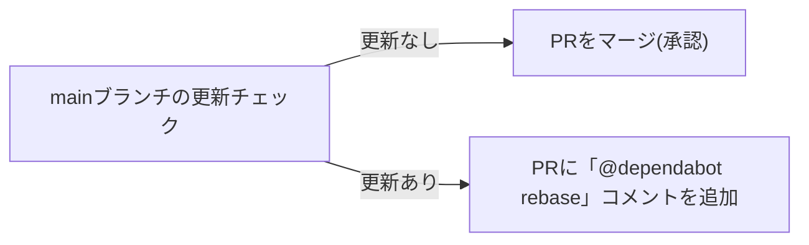

## 概要




## 使い方

### 承認
```yaml
      - uses: daiichi-g/dependabot-auto-approve@v1
        with:
          github-token: ${{ secrets.GITHUB_TOKEN }}
```

### mainブランチの更新チェックのみ
```yaml
      - uses: daiichi-g/dependabot-auto-approve@v1
        with:
          github-token: ${{ secrets.GITHUB_TOKEN }}
          check-only: true
```

## パラメータ
| パラメータ名 | 必須 | 説明 |
|:---|:---:|:---|
| github-token |必須 | GitHubトークン(※1) |
| check-only | | true: mainブランチの更新チェックのみ |
(※1) Personal access tokes(Classic)、または Fine-grained tokens(contents,pull_request Read and Write)を指定
